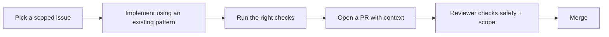
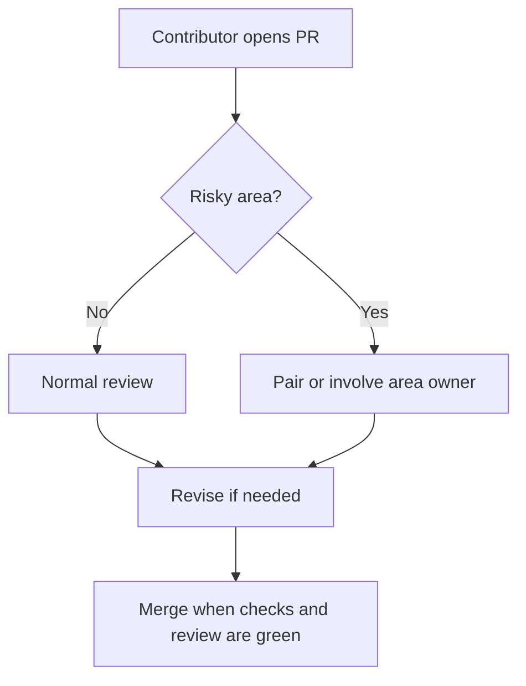

# Contributing



This repo is friendly to junior contributors, but it is not a good place to improvise around auth, access control, hooks, or schema changes. Start small, follow an existing pattern, and escalate early when you hit one of the pair-required areas.

## Workflow

### Branches

- Create a short-lived branch for each change.
- Keep each PR scoped to one outcome.
- Prefer the smallest useful PR over a broad cleanup.

### Before You Code

- Read the relevant onboarding doc for your task.
- Find an existing file that already does something similar.
- Confirm whether the work is safe to do independently or needs pairing.

### Pair-Required Areas

Stop and ask for pairing before changing:

- anything in `src/auth/`
- anything in `src/access/`
- hook-heavy collection logic
- migrations or database/storage config
- approval, session, or admin-visibility behavior

## Validation Rules

```text
If you change...                    Run...
Frontend component/page            pnpm lint && pnpm typecheck
Route behavior or UX flow          pnpm lint && pnpm typecheck && pnpm test:e2e
Payload schema or hooks            pnpm generate:types && pnpm typecheck && pnpm test:int
Payload admin components           pnpm generate:importmap && pnpm typecheck
Auth, access, or account APIs      pnpm typecheck && pnpm test:int
```

### Generated Files

These files are automatically generated and should not be edited by hand:

- `src/payload-types.ts`
- `src/app/(payload)/admin/importMap.js`

To generate these files, run:

```bash
pnpm generate:types # if you changed the schema
pnpm generate:importmap # if you changed the Payload admin components
```

### Test Accounts

Use only the shared seeded accounts:

- `test@example.com` / `test`
- `dev@payloadcms.com` / `test`

Do not create, sign up, or delete users inside tests. Note that these accounts are by default not visible, and cannot be used in production.

## Definition of Done

A change is ready for review when:

- the scope is still small and clear
- the code follows an existing local pattern
- the right validation commands were run
- generated files were updated if needed
- the PR description explains what changed, how it was tested, and where you want reviewer focus

## PR Template Checklist

Copy this into your PR description when useful:

```md
## What changed

## Why

## How I tested it

- [ ] pnpm lint
- [ ] pnpm typecheck
- [ ] pnpm test:int
- [ ] pnpm test:e2e
- [ ] pnpm generate:types
- [ ] pnpm generate:importmap

## Reviewer focus
```

## Review Norms



Reviewers should:

- protect correctness and safety first
- call out risky Payload patterns directly
- suggest the smallest safe next step
- avoid turning junior onboarding PRs into large refactors

## Start Here If You Are New

- [Onboarding index](docs/onboarding/README.md)
- [Architecture guide](docs/onboarding/architecture.md)
- [First 30 days](docs/onboarding/first-30-days.md)
- [Common workflows](docs/onboarding/common-workflows.md)
- [Payload safety rules](docs/onboarding/payload-safety.md)
