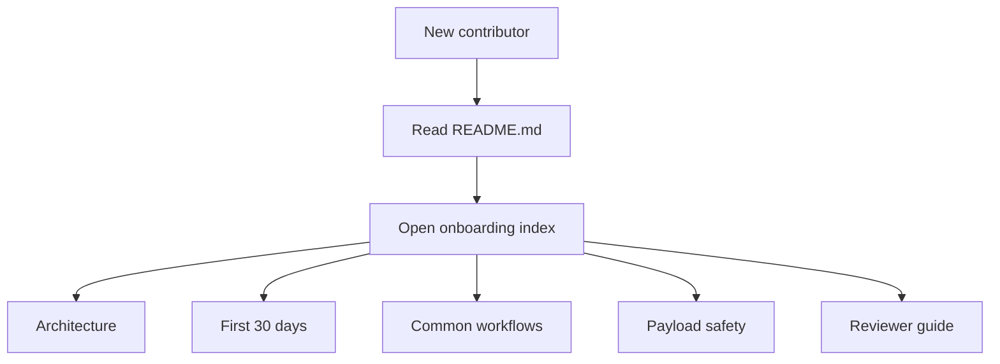
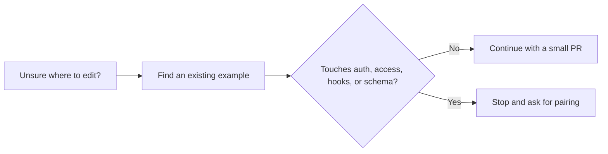

# Onboarding Guide



This doc set is the shortest safe path into the repo. If you are new, read the docs in the order below. If you are mentoring or reviewing, jump to the reviewer guide.

## Start Here

1. [Root setup guide](../../README.md)
2. [Architecture](architecture.md)
3. [First 30 days](first-30-days.md)
4. [Common workflows](common-workflows.md)
5. [Payload safety](payload-safety.md)

Reviewers and mentors should also read:

- [Reviewer guide](reviewer-guide.md)
- [Contributing workflow](../../CONTRIBUTING.md)

## Pick Your Path

```text
I need to...

change a page or component      -> common-workflows.md
change collection/global data   -> common-workflows.md + payload-safety.md
touch auth or access logic      -> payload-safety.md, then pair
review a junior PR              -> reviewer-guide.md
understand the repo shape       -> architecture.md
```

## What This Repo Looks Like

```text
Public site                -> src/app/(frontend)
Payload admin/API          -> src/app/(payload)
Collections                -> src/collections
Globals                    -> src/globals
Access control             -> src/access
Better Auth bridge         -> src/auth
Tests                      -> tests/int and tests/e2e
```

## Safe Default Behavior



## Reading Order by Experience Level

### New junior contributor

- `README.md`
- `architecture.md`
- `first-30-days.md`
- `common-workflows.md`

### Returning contributor

- `common-workflows.md`
- `payload-safety.md`

### Reviewer or mentor

- `reviewer-guide.md`
- `CONTRIBUTING.md`
- `payload-safety.md`
