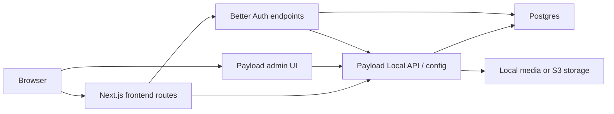
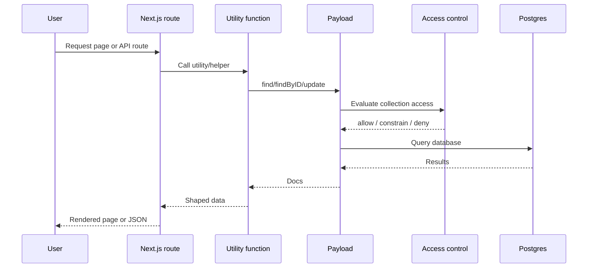
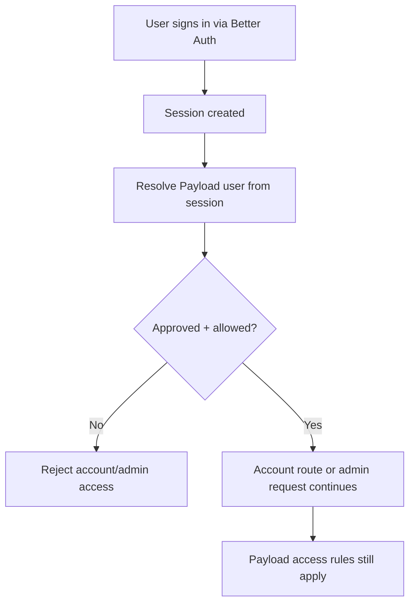
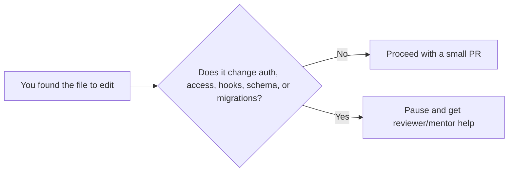

# Architecture Guide



This project is a single Next.js app that serves both the public site and the Payload admin. Payload owns the content model and most of the data rules. Next.js owns the page routes and user-facing rendering.

## Schema Overview

```mermaid
erDiagram
    Users ||--o| People : "links to"
    People ||--o{ Posts : authors
    Posts }o--o{ Categories : ""
    Posts }o--o{ Tags : ""
    Posts }o--o{ Posts : relatedPosts
    Posts }o--o| Media : heroImage
    Research }o--o| Media : image
    Research }o--o| Notebooks : notebook
    Activities }o--o| Media : heroImage
    Activities }o--o{ Posts : relatedPosts
    Activities }o--o{ Research : relatedResearch
    Wiki }o--o{ Tags : ""
    Wiki }o--o| Users : createdBy
    Wiki }o--o{ Wiki : outgoingLinks
    News }o--o| Media : ""
    Announcements }o--o| Media : ""
    People }o--o| Media : avatar

    Users {
        auth collection
    }
    People {
        profiles
    }
    Posts {
        blog articles
    }
    Research {
        lab entries
    }
    Activities {
        symposiums conferences
    }
    Wiki {
        internal wiki
    }
```

Globals (Header, Footer, HomePage, AboutPage, ContactPage) are singleton configs, not collections.

## Main Moving Parts

- `src/app/(frontend)`: public pages and account-facing routes
- `src/app/(payload)`: Payload admin shell and API routes
- `src/collections`: Payload collections like `posts`, `research`, `people`, `wiki`, and `users`
- `src/globals`: shared site data like header, footer, and homepage content
- `src/utilities`: data-fetching helpers used by routes and components

### High Risk Areas

- `src/auth`: Better Auth bridge and user/session syncing
- `src/access`: access-control rules

## Request and Content Flow



This is why small route changes often still require understanding Payload access and data helpers.

## Auth and Account Flow



Important repo facts:

- Better Auth is configured in `src/auth/betterAuth.ts`.
- Payload user auth strategy is wired in `src/collections/Users/index.ts`.
- Account-facing API routes live under `src/app/(frontend)/api/account`.

## Repo Map

```text
src/
├── app/
│   ├── (frontend)/        public pages, account routes, sitemap routes
│   └── (payload)/         Payload admin shell and API routes
├── collections/          Payload collections and collection hooks
├── globals/              Header, Footer, HomePage, AboutPage, ContactPage
├── access/               Access rules and request-level helpers
├── auth/                 Better Auth bridge, session resolution, user sync
├── components/           Reusable UI, admin components, feature components
├── utilities/            Query helpers and rendering/data utilities
└── payload.config.ts     Main Payload configuration

tests/
├── int/                  Vitest integration tests
└── e2e/                  Playwright browser tests
```

## Where Do I Make This Change?

```text
Need to change...

A public page layout or page copy?
-> start in src/app/(frontend) or src/components

A collection field, admin form, or publish behavior?
-> start in src/collections

Sitewide header/footer/home content model?
-> start in src/globals

Who can see/edit something?
-> start in src/access and pair if unsure

Login, sessions, approvals, or account APIs?
-> start in src/auth or src/app/(frontend)/api/account and pair

Payload admin branding or injected admin UI?
-> start in src/components/admin, src/components/BeforeDashboard, or payload config
```

## Real Examples in This Repo

- Public post data is fetched through utilities like `src/utilities/getPosts.ts`.
- A representative account API route is `src/app/(frontend)/api/account/dashboard/route.ts`.
- Access rules for authored posts live in `src/access/adminOrAuthoredPost.ts`.
- Core CMS wiring lives in `src/payload.config.ts`.

## Stop and Ask Here


