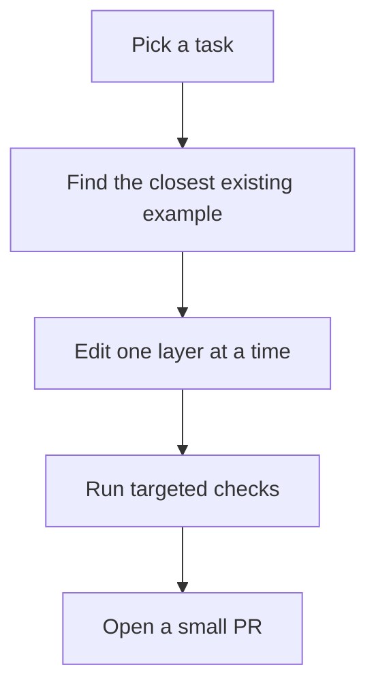
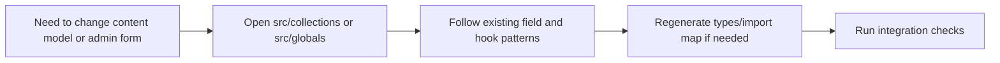
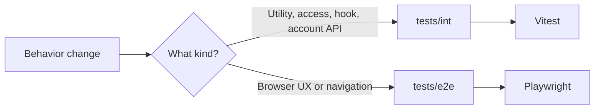
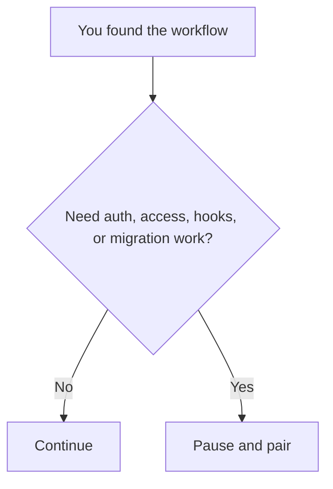

# Common Workflows



Use this guide when you already know what you want to change and need the safest route through the codebase.

## 1. Frontend Tweak

```text
Route page?        -> src/app/(frontend)
Shared component?  -> src/components
Styling/layout?    -> local component styles or globals.css
```

Typical flow:

1. Start from the page in `src/app/(frontend)`.
2. Follow imports into `src/components` or `src/utilities`.
3. Make the smallest possible UI change.
4. Run:

```bash
pnpm lint
pnpm typecheck
```

Also run `pnpm test:e2e` if the change affects navigation, search, account UX, or admin/frontend interaction.

## 2. Collection or Global Update



Typical flow:

1. Find the matching collection in `src/collections` or global in `src/globals`.
2. Change fields, admin config, or low-risk behavior.
3. If you changed schema, run:

```bash
pnpm generate:types
```

4. If you changed Payload admin components, run:

```bash
pnpm generate:importmap
```

5. Validate:

```bash
pnpm typecheck
pnpm test:int
```

Pair before changing hooks or access logic.

## 3. Query or Data-Fetch Change

The safest pattern is:

```text
route/component -> utility in src/utilities -> Payload query -> shaped result
```

Look at existing utilities such as:

- `src/utilities/getPosts.ts`
- `src/utilities/getNews.ts`
- `src/utilities/getPeople.ts`

Rules:

- prefer editing an existing utility instead of scattering query logic
- keep selects narrow
- when authorizing as a user in Local API, include `overrideAccess: false`

Validation:

- `pnpm typecheck`
- `pnpm test:int`
- `pnpm test:e2e` if the change affects visible browsing flows

## 4. Admin UI Change

```text
Admin branding/components -> src/components/admin
Dashboard injection       -> src/components/BeforeDashboard
Payload config wiring     -> src/payload.config.ts
```

Typical flow:

1. Edit the component.
2. Confirm the component path is still wired in `src/payload.config.ts`.
3. Regenerate the import map:

```bash
pnpm generate:importmap
```

4. Run:

```bash
pnpm typecheck
```

## 5. Test Update



Use:

- `tests/int` for utilities, hooks, access control, account APIs, and Payload-integrated logic
- `tests/e2e` for user journeys in the browser

Shared test accounts are already expected by the repo. Reuse them. Do not create or delete users in tests.

## Test Strategy

```text
Quick confidence
- pnpm lint
- pnpm typecheck

Behavioral correctness
- pnpm test:int

Browser workflow confidence
- pnpm test:e2e
```

## Safe First Tasks

- tighten a page layout or copy block
- add coverage around an existing utility
- improve an existing e2e assertion
- add a low-risk field description or admin label

## Stop and Ask Here


