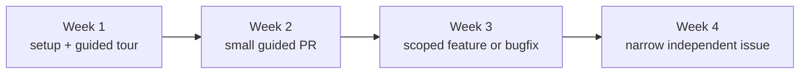
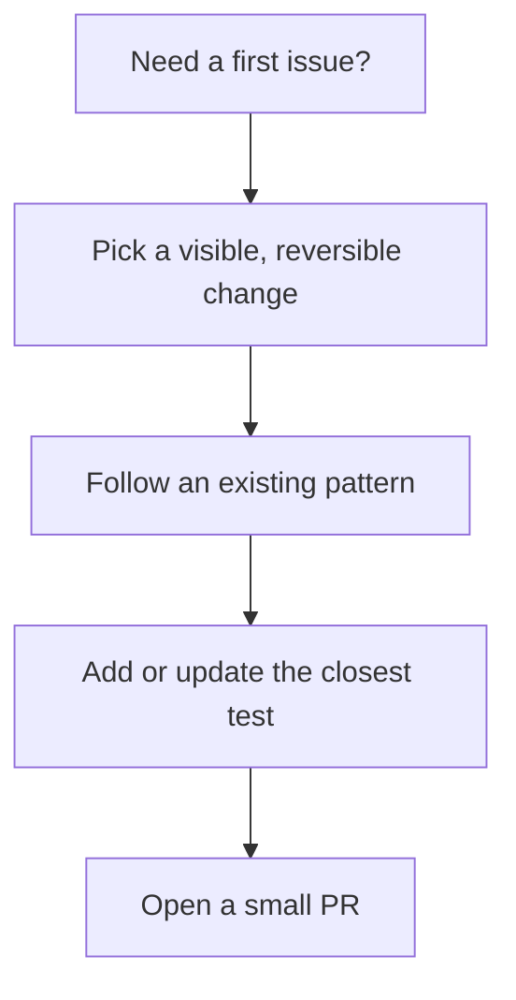

# First 30 Days



Your first month should build confidence without pushing you into the riskiest parts of the codebase too early. The goal is not full ownership yet. The goal is to ship small, correct PRs and know when to escalate.

## Week-by-Week Plan

### Week 1: Learn the shape of the app

Do this:

- run the app locally
- log into the frontend and admin using the shared test accounts
- read `README.md`, `architecture.md`, and `payload-safety.md`
- trace one frontend page and one Payload collection from route to data source
- make one tiny docs or low-risk UI change

Stop and ask if:

- local setup does not match the docs
- you need to touch `src/auth` or `src/access`
- you are unsure which test suite covers your change

### Week 2: Ship a safe, guided PR

Safe work in week 2:

- update a frontend component
- change archive page copy or layout
- add a small query filter using an existing utility pattern
- adjust a collection/global field description or admin presentation

Pair if the change touches:

- collection hooks
- access rules
- user approval or admin visibility
- migrations

### Week 3: Own a scoped bugfix or feature

You can usually own:

- one route-level UI fix
- one collection/global content-model tweak with guidance
- one account page or dashboard presentation change that does not alter auth rules

You should still pair on:

- schema changes with unclear migration impact
- access constraints
- session or approval behavior

### Week 4: Take a narrow issue independently

By week 4, you should be able to:

- find the right edit location
- follow an existing repo pattern
- run the right checks
- open a reviewable PR with a clear test note

You are still not expected to independently own:

- auth architecture
- access-control refactors
- risky hook chains
- database/storage configuration

## Ownership Matrix

```text
Safe to own early
- page/component tweaks
- low-risk query or UI cleanup
- test additions near existing patterns

Reviewer-required
- collection/global field changes
- route behavior changes
- admin UI changes

Pair-required
- src/auth/*
- src/access/*
- new or changed hooks with nested Payload operations
- schema migrations
- approval/session/admin visibility logic
```

## Safe First Tasks



Good first tasks:

- copy or layout polish on an existing page
- refactor a repeated presentational component without changing behavior
- add coverage for an existing utility
- small collection/global admin copy improvements
- e2e assertion improvements on an existing user journey

Avoid as first tasks:

- building a new auth flow
- changing access control semantics
- altering approval rules
- introducing a new migration path

## Escalation Rule

```text
If the change can lock people out, leak data, create orphaned records,
or require a migration, stop and ask for pairing before you continue.
```
