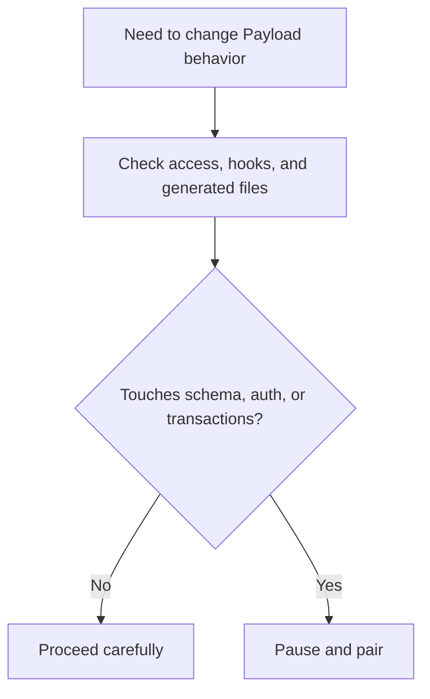
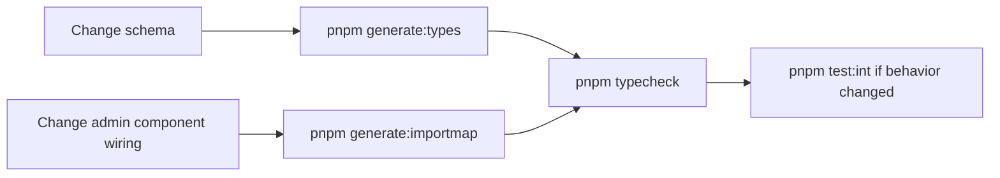
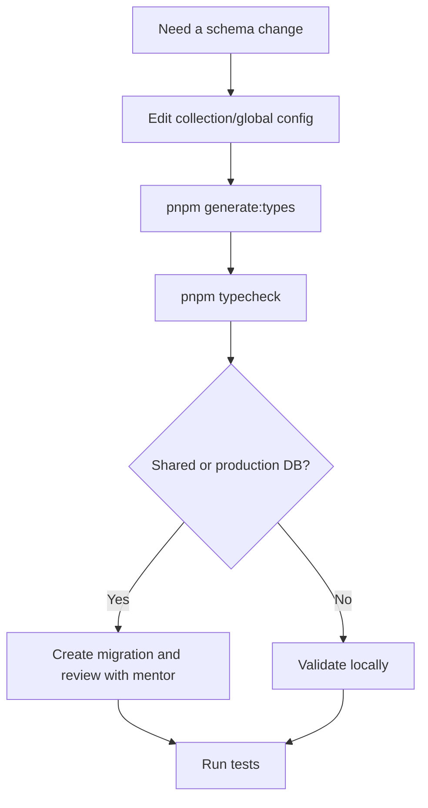
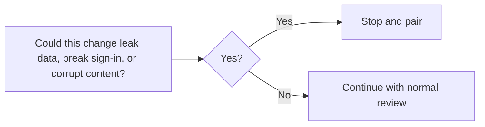

# Payload Safety Rules



This is the most important onboarding doc for avoiding subtle bugs. Payload gives you a lot of power quickly. That also means it is easy to bypass safety rules by accident.

## Rule 1: Respect Access Control in Local API Calls

If you pass a user context to the Local API, explicitly set `overrideAccess: false`.

Safe pattern:

```ts
await payload.find({
  collection: 'posts',
  user: someUser,
  overrideAccess: false,
})
```

Unsafe pattern:

```ts
await payload.find({
  collection: 'posts',
  user: someUser,
})
```

Why this matters:

- Payload Local API bypasses access control by default.
- A missing `overrideAccess: false` can expose or mutate data with admin-level privileges.

## Rule 2: Pass `req` Through Nested Hook Operations

If a hook makes another Payload call, pass `req`.

Safe pattern:

```ts
await req.payload.update({
  collection: 'posts',
  id: doc.id,
  data: nextData,
  req,
})
```

Why this matters:

- nested operations stay inside the same request/transaction context
- hook side effects stay consistent
- you reduce the risk of partial writes

## Rule 3: Prevent Hook Loops

If a hook writes back into the same collection or flow, use a context flag to avoid infinite recursion.

```text
hook runs -> writes another document -> hook runs again -> loop
```

If you need this kind of change and do not already see an established local pattern, pair before editing.

## Rule 4: Regenerate Committed Artifacts



Run:

- `pnpm generate:types` after schema changes
- `pnpm generate:importmap` after creating or changing Payload admin components or their wiring

These generated files are committed:

- `src/payload-types.ts`
- `src/app/(payload)/admin/importMap.js`

## Rule 5: Treat Migrations as a Deliberate Step

Schema work on shared or production databases is not just “edit the field and move on.”



When in doubt:

- pair before creating a migration
- do not rely on ad hoc schema push for shared environments

## Rule 6: Use the Shared Test Accounts

Use:

- `test@example.com` / `test`
- `dev@payloadcms.com` / `test`

Do not create or delete users inside tests. The repo already has a seeding script and tests are written around the shared accounts.

## Pair-Required Areas

```text
Always pair before changing:
- src/auth/*
- src/access/*
- approval or session logic
- collection hooks with nested Payload writes
- migrations
- storage/database configuration
```

## Safety Checklist

Before you open a PR, confirm:

- Local API calls with a user context include `overrideAccess: false`
- nested hook operations pass `req`
- you did not introduce a hook loop
- generated files were refreshed if needed
- the validation commands match the change

## When To Escalate


