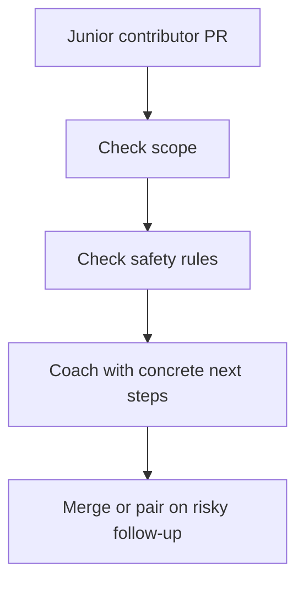
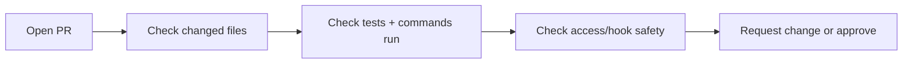
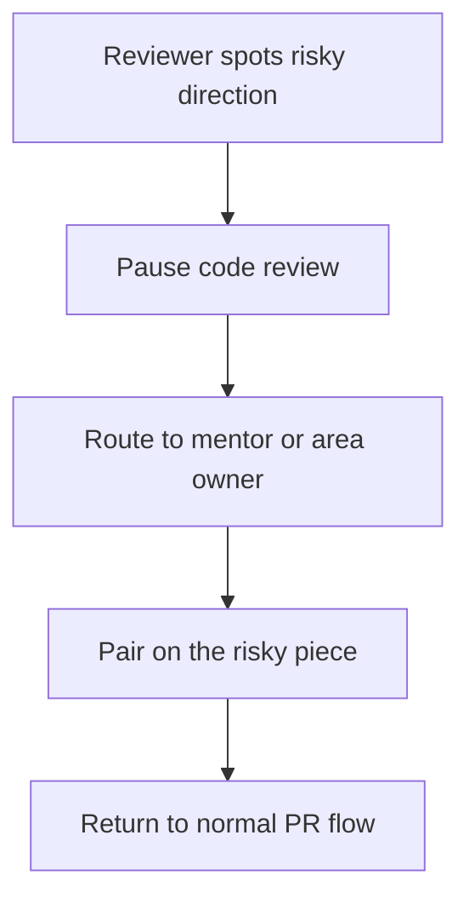

# Reviewer Guide



Use this guide to review junior-friendly PRs without relying on tribal knowledge. The goal is not just to catch bugs. The goal is to teach the repo’s safe patterns while keeping momentum high.

## Review Priorities

Check in this order:

1. Is the PR scoped narrowly enough?
2. Is the edit in the right layer?
3. Does it respect Payload safety rules?
4. Were the right checks run?
5. Is the next best step still small?

## Ownership Boundaries

```text
Junior-safe with review
- page/component tweaks
- UI cleanup
- low-risk query shaping
- test improvements near existing patterns

Needs stronger reviewer attention
- collection/global field updates
- route behavior changes
- admin UI wiring

Pair-required
- src/auth/*
- src/access/*
- hook-heavy logic
- migrations
- approval/session/admin visibility behavior
```

## PR Review Checklist



Use this checklist on every onboarding PR:

- scope stays focused on one outcome
- changed files match the claimed task
- existing local patterns were reused
- Local API calls with user context use `overrideAccess: false`
- hook-triggered nested operations pass `req`
- generated files were updated when needed
- the contributor ran the correct validation commands
- the PR description says where you should focus review

## Coaching Guidelines

Do:

- point to the closest existing example in the repo
- explain why a Payload rule matters
- suggest the smallest safe correction
- convert “big redesign” feedback into a follow-up issue

Do not:

- ask a junior contributor to solve auth or schema architecture in a drive-by comment
- expand a small onboarding PR into a broad refactor
- assume they know which test suite to run

## Risk Flags

```text
Escalate quickly if you see:
- src/auth or src/access edits
- a new hook making nested Payload writes
- missing overrideAccess: false on user-scoped Local API calls
- generated files drifting from source config
- migration-impacting schema edits with no migration plan
```

## Reviewer-to-Mentor Handoff



Use pairing when:

- the contributor found the right area but the change crosses a safety boundary
- the correct next step is educational, not just corrective
- the PR is blocked on system context rather than effort
