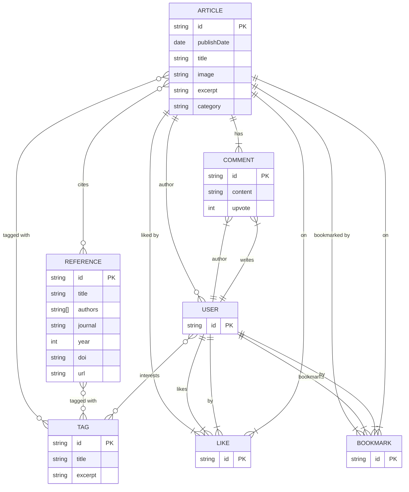

# Roadmap

## Current Status

The NABI website is currently in an active development state. The website is currently hosted on GitHub Pages and is automatically deployed when changes are pushed to the `main` branch.

## Future Plans

### Features Development

- [ ] Basic CRUD operations for articles and paper bibliographies.
- [ ] Add a "like" and "bookmark" button to each article.
- [ ] Add a comment system to each article.
- [ ] Add a newsletter management system to the website.
- [ ] Add a user profile page to the website.
- [ ] Add a user dashboard to the website.
- [ ] Add a user settings page to the website.

### Database Design



### Frontend Development

#### Astro Components (Static Content & SEO)

- [ ] Enhance existing Astro layouts for better SEO optimization
- [ ] Create static article templates with improved metadata
- [ ] Implement static site generation for blog posts and research content
- [ ] Add structured data (JSON-LD) for better search engine visibility
- [ ] Create static pages for user profiles and research areas
- [ ] Implement static search functionality with Pagefind
- [ ] Add RSS feeds and sitemap generation
- [ ] Create static newsletter subscription forms

#### React Components (Interactive Features)

##### Core Interactive Components

- [ ] Create reusable React components for dynamic user interactions
- [ ] Implement like and bookmark buttons with real-time updates
- [ ] Build comment system with nested replies and upvoting
- [ ] Create user authentication components (login, register, profile)
- [ ] Implement real-time notification system
- [ ] Build interactive search and filtering components
- [ ] Create user dashboard and settings interfaces

##### Advanced Interactive Features

- [ ] Real-time comment updates and notifications
- [ ] Interactive article recommendations
- [ ] Dynamic tag filtering and browsing
- [ ] Advanced search with autocomplete
- [ ] Social sharing with analytics tracking
- [ ] Reading progress indicators
- [ ] Dark/light theme toggle with persistence

#### Hybrid Integration

- [ ] Integrate React components into Astro pages using client directives
- [ ] Set up state management for cross-component communication
- [ ] Implement hydration strategies for optimal performance
- [ ] Create shared styling system between Astro and React
- [ ] Set up API integration layer for React components
- [ ] Implement progressive enhancement patterns

#### Performance & Optimization

- [ ] Optimize Astro static generation for large content volumes
- [ ] Implement React component code splitting and lazy loading
- [ ] Add service worker for offline functionality
- [ ] Optimize image loading with Astro's image optimization
- [ ] Implement skeleton loading states for React components
- [ ] Optimize Core Web Vitals for both static and interactive content
- [ ] Set up proper caching strategies for static and dynamic content

### Backend Development (perform in `go`)

#### API Development

- [ ] Set up Go project structure with clean architecture
- [ ] Implement RESTful API endpoints for all CRUD operations
- [ ] Create authentication and authorization middleware
- [ ] Build user management system
- [ ] Implement article and reference management APIs
- [ ] Create comment system with moderation features
- [ ] Build like and bookmark functionality
- [ ] Implement tag management system

#### Database Integration

- [ ] Set up database connection and migrations
- [ ] Implement repository pattern for data access
- [ ] Create database models matching the ER diagram
- [ ] Implement efficient querying with proper indexing
- [ ] Add database transaction handling
- [ ] Set up connection pooling
- [ ] Implement soft delete functionality

#### Authentication & Security

- [ ] Implement JWT-based authentication
- [ ] Add role-based access control (RBAC)
- [ ] Implement password hashing and validation
- [ ] Add rate limiting for API endpoints
- [ ] Implement CORS configuration
- [ ] Add input validation and sanitization
- [ ] Set up logging and monitoring

#### Business Logic

- [ ] Implement article publishing workflow
- [ ] Create comment moderation system
- [ ] Build notification system for user interactions
- [ ] Implement newsletter subscription management
- [ ] Add analytics and tracking capabilities
- [ ] Create content recommendation engine
- [ ] Implement search functionality with full-text search

#### API Endpoints Structure

```plaintext
/api/v1/
├── auth/
│   ├── login
│   ├── register
│   ├── refresh
│   └── logout
├── users/
│   ├── profile
│   ├── dashboard
│   └── settings
├── articles/
│   ├── list
│   ├── create
│   ├── update
│   ├── delete
│   ├── like
│   └── bookmark
├── comments/
│   ├── list
│   ├── create
│   ├── update
│   ├── delete
│   └── upvote
├── tags/
│   ├── list
│   └── articles
├── references/
│   ├── list
│   ├── create
│   └── update
└── newsletter/
    ├── subscribe
    └── unsubscribe
```

#### Testing & Quality Assurance

- [ ] Write unit tests for all business logic
- [ ] Implement integration tests for API endpoints
- [ ] Add API documentation with Swagger/OpenAPI
- [ ] Set up CI/CD pipeline
- [ ] Implement health checks and monitoring
- [ ] Add error handling and logging
- [ ] Performance testing and optimization

### Development Workflow

#### Phase 1: Static Enhancement (Astro)

- [ ] Enhance existing Astro components and layouts
- [ ] Implement static site generation improvements
- [ ] Add SEO optimizations and structured data
- [ ] Create static content management workflows

#### Phase 2: Interactive Features (React)

- [ ] Develop React components for user interactions
- [ ] Integrate React components into Astro pages
- [ ] Implement state management and API integration
- [ ] Add real-time features and notifications

#### Phase 3: Backend Integration (Go)

- [ ] Develop Go API endpoints
- [ ] Set up database and authentication
- [ ] Connect frontend components to backend APIs
- [ ] Implement full-stack functionality

#### Phase 4: Optimization & Deployment

- [ ] Performance optimization for both static and dynamic content
- [ ] Set up proper deployment pipelines
- [ ] Implement monitoring and analytics
- [ ] Add advanced features and refinements

### Deployment

- [ ] Move deployment of Backend to AWS Lambda
- [ ] Move deployment of Frontend to AWS S3 or Cloudflare Pages
- [ ] Add a CDN to the website. (Cloudflare Wrangler)
